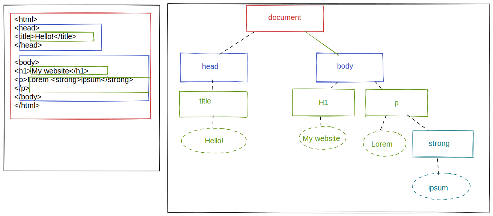
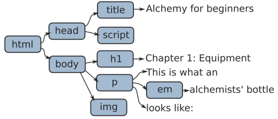

# Introduction

## The concepts

### The DOM tree

The Document Object Model allows us to visualize any HTML document as a "tree". The tree is made of `nodes`, being the different HTML elements in the page. Each document consists of a root node, which contains all the subsequent child nodes.



A node containing one or many nodes will be called a `parent node` whilst the contained nodes will be named `children nodes`.


### Text nodes

At the end of the line we find `text nodes`. Those are special nodes that cannot bear a child, nor have attributes. For example :
```html
<p>Hello</p>
```

Here we have `p` node containing a `Hello` textnode.

### Other nodes

Attributes can also be manipulated as nodes. HTML comments as well.

### Accessing the DOM using Javascript

There are some predefined Javascript objects in your browser. The DOM is one of them. If you open a console and type in `document.` you'll see a list of accessors to the DOM tree.

Your exploration starts here...


## Exercises:



- What would be the corresponding HTML code for the tree drawn above?
- Open the [index.html](./index.html) and try to draw the corresponding DOM tree (either on a drawing app, or with plain old pen and paper)
- Edit the [script.js](./script.js) to
  - Display the document title in the console
  - Change the document title to `Modifying the DOM`
  - Change the background color of the body to hot pink (#FF69B4). If that worked, try with a random color as an extra challenge. (tip: You can use the `rgb()` notation and 3 random-generated numbers between 0 and 255).
  - Using the children method and a `for ... of ` loop, display every children elements of the second child element of your document (display all children elements of the `<body>`)


## Ready to continue ? Let's take care of those trees


